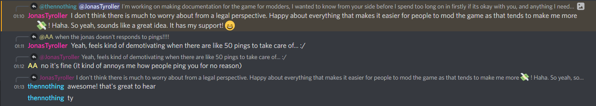

# WYS-Documentation
 This repo exists with the goal of providing adaqute documentation for modders on the functions in [Will You Snail](https://store.steampowered.com/app/1115050/Will_You_Snail/).

## Getting Started
 The file tree of this project is split into global scripts and object scripts. Currently the plan is only to document *functions* (that means anything that starts with `function` or `= function()`, not entire events.)

## Help Wanted!
 Currently this is a pretty barebones repo, but I (and a few others now) are working on it.
 Any help in the documentation process, or cleaning up and providing more useful descriptions would be greatly appreciated. If you decide to contribute to this repo, please refer to [CONTRIBUTING](CONTRIBUTING.md) to outline how to contribute to this project. Anyone who contributes (good) pull requests to this project be added to a list of contributors below and receive my thanks :)

## Contributors
 - thennothinghappened (thennothing#4011)
 - kenan238 (kenan238#6162)
 - Kiffolisk (GAMERSUNITE#4872)
 - JeremyGamer13 (JeremyGamer13#7984)
 - Soinpro (aZo9_x#6855)

## Is this allowed?
 